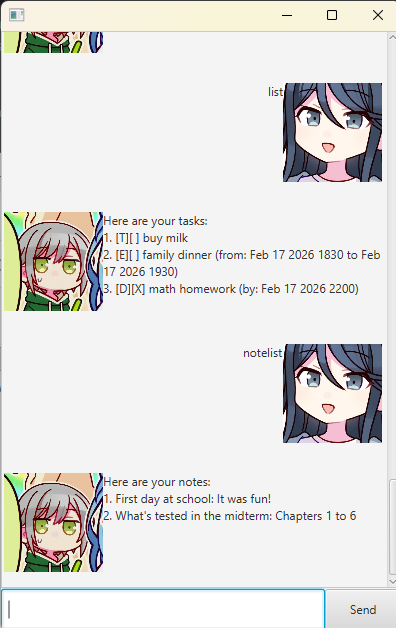

# Shiho User Guide



> We've got a lot to get through, so let's stay focused. - Shiho Hinomori

Ever felt this way before? Fear not, with ShihoBot, you'll no longer have to struggle through the following things ever again:
- Rummaging through tons of tasks and struggling to find a specific one
- Trying to get a consolidated, clear representation of all your tasks
- ~~Editing existing tasks in the case of a last-minute change~~ (okay, ShihoBot isn't THAT good... yet)

Here's what you need to do to get it running:
1. Download the .jar file [here.](https://github.com/darrenlhs/ip/releases/tag/A-Release)
2. Run the file.
3. Learn the commands (which is **really easy and simple**)
4. Use it and feel your worries start floating away ☁️

What ShihoBot can currently do:
- [x] Add new tasks to the list
- [x] Save existing tasks to the disk in a .txt file
- [x] Remove, mark/unmark and find specific tasks

Now, let's cover all key features that Shiho currently has to offer!

Table of Features:
- [Exiting the current instance (```bye```)](#exiting-the-current-instance)
- [Adding tasks (```todo```, ```deadline``` and ```event```)](#adding-tasks)
- [Listing tasks (```list```)](#listing-tasks)
- [Marking and unmarking tasks (```mark``` and ```unmark```)](#marking-and-unmarking-tasks)
- [Deleting tasks (```delete```)](#deleting-tasks)
- [Finding tasks (```find```)](#finding-tasks)
- [Adding notes (```notenew```)](#adding-notes)
- [Listing notes (```notelist```)](#listing-notes)
- [Deleting notes (```notedelete```)](#deleting-notes)
- [Invalid inputs](#invalid-inputs)

## Exiting the current instance 

By using the ```bye``` command, Shiho instantly exits its current instance, saving any stored tasks and notes to your local task and note text files, allowing for retrieval on the next launch. Take note that the entire window will be closed upon using this command. 

*It is recommended to use this over just exiting by clicking the 'X' button in the top right corner to ensure that your tasks and notes are properly saved to your system.* 

**Basic syntax:** 
```
bye
```

## Adding tasks

Adding tasks **(of which there are 3 types: ToDo, Deadline and Event)** causes them to be stored to your local task list text file. Each of them has slightly different syntax.

**Basic syntax:**

ToDo:
```
todo (task description)
```

Deadline:
```
deadline (task description) /by (deadline)
``` 

**(```deadline``` is in YYYY-MM-DD XXXX format, where XXXX is 24-hour time)**

Event:
```
event (task description) /from (time) /to (time)
```

**(Similar to ```deadline```, ```time``` is in YYYY-MM-DD XXXX format)**

**Examples (all times must be in the specified format, and all slashes are mandatory!):**
```
todo buy groceries
```

```
deadline math homework /by 2026-02-17 2200
```

```
event family dinner /from 2026-02-17 1830 /to 2026-02-17 1930
```

**Outputs for all 3 examples above (assuming they are done consecutively in the same instance):**
```
Got it. I've added this task: [T][] buy groceries
Now you have 1 task in the list.
```

```
Got it. I've added this task: [D][] math homework (by Feb 17 2026 2200)
Now you have 2 tasks in the list.
```

```
Got it. I've added this task: [E][] family dinner (from: Feb 17 2026 1830 to Feb 17 2026 1930)
Now you have 3 tasks in the list.
```

## Listing tasks

The ```list``` command will list all currently stored tasks in your task list. If your task list is empty, a corresponding response will be printed out. 

**Basic syntax:** 
```
list
```
**(Leave no spaces whatsoever. It is just the word 'list'.)**

**Output (using the 3 added tasks from earlier):**
```
Here are your tasks:
1. [T][] buy groceries
2. [D][] math homework (by: Feb 17 2026 2200)
3. [E][] family dinner (from: Feb 17 2026 1830 to Feb 17 2026 1930)
```

## Marking and unmarking tasks

The ```mark``` and ```unmark``` commands are used to mark completion of your tasks. They are useful for tracking which tasks you've already done and which ones are yet to be completed. Marking an already done task or unmarking an undone task has no additional effect.

**Basic syntax:**

```
mark (index)
```

```
unmark (index)
``` 

**(Take note that the index starts from 1, not 0! It matches the numbered listing of your tasks in the ```list``` command.)**

**Examples:**
```
mark 1
```

```
mark 2
```

```
unmark 2
```

**Outputs:**
```
Okay, I've marked this task as done:
   [X] buy groceries
```

```
Okay, I've marked this task as done:
   [X] math homework
```

```
Okay, I've marked this task as not done yet:
   [] math homework
```

## Deleting tasks

The ```delete``` command allows you to remove a specific task from the list permanently. Again, this index starts from 1 and corresponds to the task's numbered listing from the ```list``` command.

**Basic syntax:**
```
delete (index)
```

**Example:**
```
delete 3
```

**Output:**
```
Noted. I've removed this task:
   [E][] family dinner (from: Feb 17 2026 1830 to Feb 17 2026 1930)
Now you have 2 tasks in the list.
```

## Finding tasks

The ```find``` command allows you to filter tasks depending on a specific character or phrase. The matching tasks will be listed in numbered order (though the number might not correspond to their numbering in the main task list).

**Basic syntax:**
```
find (search phrase)
```

**Example:**

```find homework```

**Output:**
```
Here are the matching tasks in your list:
1. [D][] math homework (by: Feb 17 2026 2200)
```

## Adding notes

On top of managing tasks, Shiho can also help you to store notes. Notes come with a title and description, and are represented in the format "(title): (description)" in lists. First, let's go through adding new notes. This is done through the ```notenew``` command.

**Basic syntax:**
```
notenew /title (title) /desc (description)
```

**Example (adding 2 notes):**
```
notenew /title First day of school /desc It was fun!
```

```
notenew /title What's tested for the midterms /desc Chapters 1 to 5
```

**Outputs:**
```
Got it. I've added this note:
First day of school: It was fun!
Now you have 1 note in the list.
```

```
Got it. I've added this note:
What's tested for the midterms: Chapters 1 to 5
Now you have 2 notes in the list.
```

## Listing notes

Similar to the ```list``` command for tasks, but for notes instead.

**Basic syntax:**
```
notelist
```

(Again, no extra spaces anywhere.)

**Output:**
```
Here are your notes:
1. First day of school: It was fun!
2. What's tested for the midterms: Chapters 1 to 5
```

## Deleting notes

Similar to the ```delete``` command for tasks, but for notes instead.

**Basic syntax:**
```
notedelete (index)
```

(as usual, index starts from 1 and matches the numbered ordering of your notes in the note list)

**Example:**
```notedelete 1```

**Output:**
```
Noted. I've removed this note:
First day of school: It was fun!
Now you have 1 note in the list.
```

## Invalid inputs

Lastly, any invalid inputs, mostly due to incorrect syntax (such as extra spaces or typos in the commands), will incur the following response from Shiho: ```Your input is either empty or not recognised. Please try again.```

**Thank you for reading to the end of this user guide! :D**